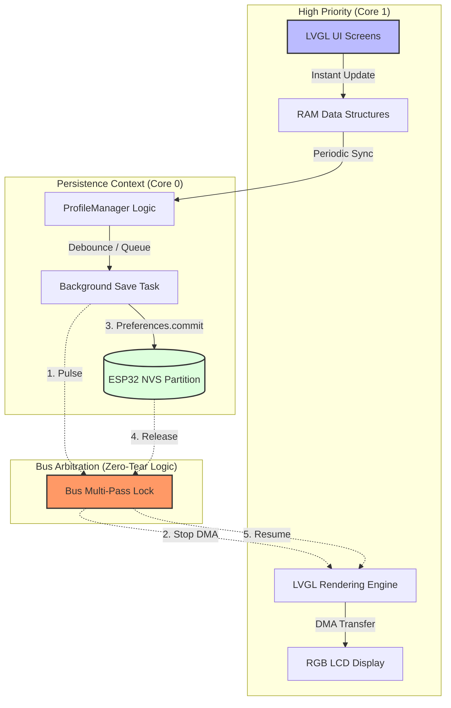

# Zero-Tear Persistence Minimal Example

This project demonstrates a robust "Zero-Tear" persistence architecture for ESP32 systems using RGB LCDs. It solves the common issue of display flickering and horizontal tearing caused by the high current spikes and bus contention inherent in NVS (Non-Volatile Storage) flash writes.

## System Architecture

The following diagram illustrates the arbitration logic and data flow that ensures a flicker-free user experience:

## Key Principles

1. **Decoupled Writes**: User interaction updates RAM instantly. Persistent storage is handled in the background, preventing the UI from blocking.
2. **Bus Locking**: Before any flash write occurs, the system signals the display driver to pause DMA transfers. This "Blackout/Pause" state prevents the display controller from reading corrupted data during the voltage/current transient of a flash write.
3. **Core Isolation**: The Save Task runs on Core 0 (Protocol Core), keeping Core 1 (APP Core) dedicated to high-speed UI rendering.
4. **Debounced Syncing**: To minimize flash wear and power spikes, saves are debounced (e.g., 3-5 seconds of idle) or triggered only on critical transitions.

## Project Structure
- `ProfileManager.cpp/h`: Manages the background task and bus locking logic.
- `AppTypes.h`: Defines the structures for data being persisted.
- `minimal_persistence_example.ino`: Orchestrates the initialization and provides a test bench.
- `esp_panel_board_custom_conf.h`: Hardware-specific configuration for Waveshare 4.3" RGB LCD.
